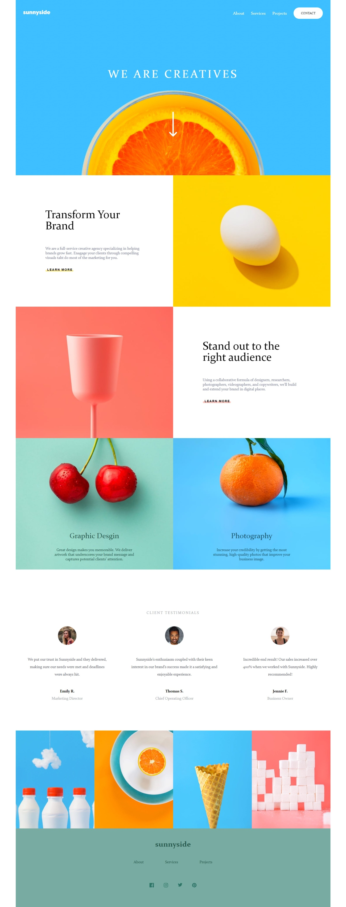

# Frontend Mentor - Sunnyside agency landing page

## Table of contents

- [Overview](#overview)
  - [The challenge](#the-challenge)
  - [Screenshot](#screenshot)
  - [Links](#links)
  - [Built with](#built-with)
  - [What I learned](#what-i-learned)
  - [Continued development](#continued-development)
  - [Useful resources](#useful-resources)
- [Author](#author)

## Overview

### The challenge

Users should be able to:

- View the optimal layout for the app depending on their device's screen size
- See hover states for all interactive elements on the page
- Generate a new piece of advice by clicking the dice icon

### Screenshot

### Links

- Solution URL: [https://github.com/mk513147/Sub-Project-4.git]
- Live Site URL: [https://mk513147.github.io/Sub-Project-4/]

### Built with

- Semantic HTML5 markup
- CSS custom properties
- Flexbox
- CSS Grid

### What I learned

This challenge improved my skill.

### Continued development

I want to learn more about website designs.

### Useful resources

- [https://fonts.google.com/] - This is an amazing website which helped me in applaying amazing fonts to my website.

## Author

- Website - [Mohit Kumar](https://www.your-site.com)
- Frontend Mentor - [@mk513147](https://www.frontendmentor.io/profile/mk513147)

